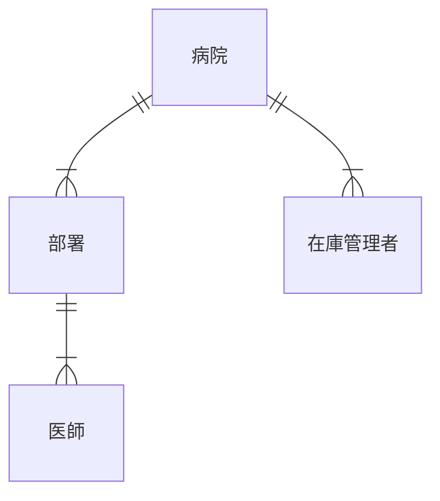
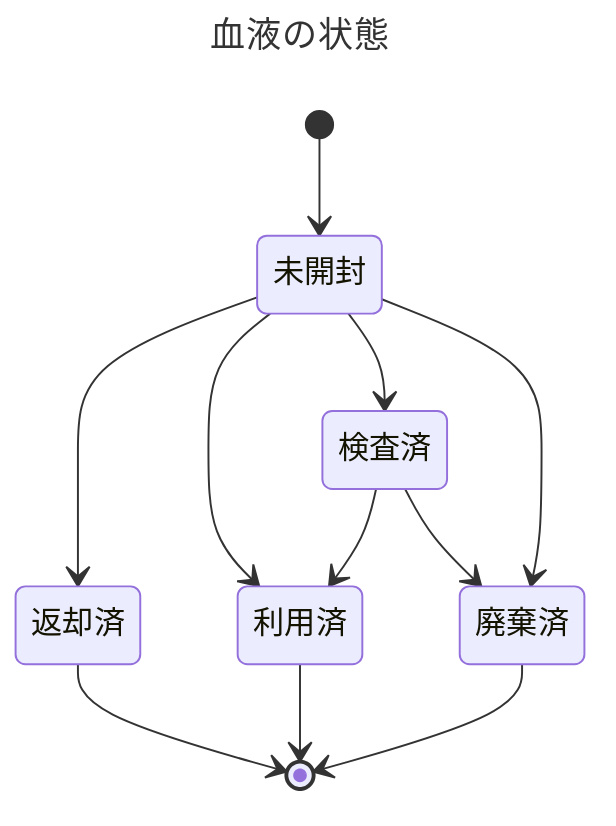
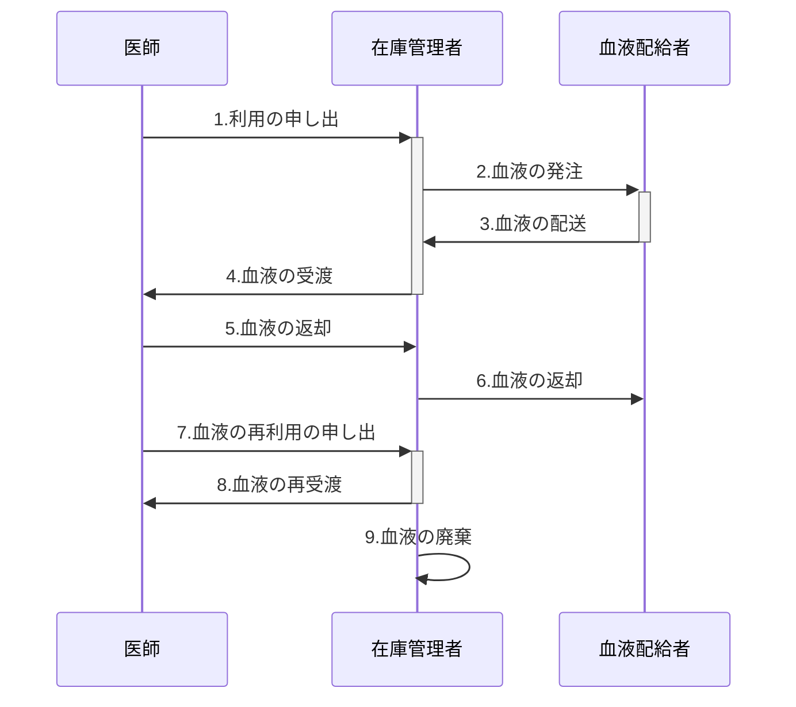
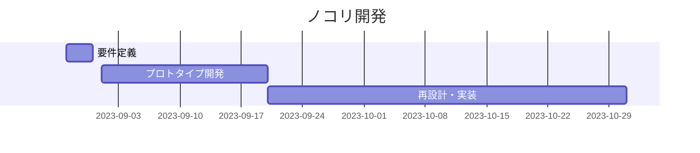

# 企画書

- 作成者: 横山巧駆 <seekseep@gmail.com>
- 作成日: 2023年8月28日

# はじめに

石油や木材などの資源は生み出すために人間の寿命やそれよりも長い時間が必要になる。2023年現在、SDGsを掲げて世界中で持続可能な社会の実現を目指している人が世界中にいる。
有限な資源として数えられるものの中に血液も含まれる。日本では20歳から60歳まで献血を最大回数の献血を行ったとしても一生をかけて約１００リットルしか献血できない仕組みになっている。
世界各国で献血の制度は様々な形をとっている。それぞれの献血の制度は常に課題を抱えているが、制度の優劣を簡単に決められるものではない。
この限られた資源である血液を無駄なく扱うために医療現場では手術や治療の予定を調整するなどさまざまな工夫が行われているが未だ改善の余地があるのが現状である。
自発的に献血参加するする人々や医療現場で患者のために働く医療従事者の思いをより多くの人に届けるためにこの企画に取り組みたい。

# 概要

これは病院内で利用する血液の在庫管理システムの開発プロジェクトである。血液は潤沢な資源ではなく、有効活用をすることが経済的な視点だけではなく社会的な視点としても求められるものである。
無駄のないように在庫の状態を院内に共有し、使用機会を失わないことを目標とする。使用機会を失わないために自動連絡と状態管理に焦点をあてて設計を行う。
連絡を人が介入しないようにすることで、在庫管理者の作業の負担と心理的な負担を軽減し適切に連絡が届くことを目指す。
また、血液には様々な特性があり利用用途によって必要とする条件は異なる。血液の性質と業務の流れに着目し一般的な在庫管理システムを超えた業務への適応を目指す。

# 目的
病院内で廃棄する血液を削減するために在庫状況の周知を目的とする

## 成果物
血液の在庫管理を行うWebアプリケーション

## 前提

当システムで扱う業務に限って関係する業務についてまとめる。

今回想定する当システムを導入する病院では、在庫管理に関するシステムは導入されておらず、管理者がエクセルなどの表計算ソフトを利用して管理している状態とする。

### 病院の構成

病院には職員が存在する。病院には内科などの部署が複数存在する。また、病院には職員が複数存在する。
職員には医師と在庫管理者が存在し、医師は１つの部署に所属している。
在庫管理者は血液の在庫の管理を担当し、医師は血液を使って治療を担当する。

### 血液配給者

ここでは赤十字社のことを血液配給者とする。在庫管理者は血液配給者に血液を発注することで血液を手に入れる。

### 血液の返却

血液が完全に未開封の場合は血液配給者に返却することができるが、利用のための検査などの目的で開封してしまうと返却することができない。血液の検査にはある程度の時間を要するので利用前に事前に検査が必要になる場合がある。

手術では必要な血液の量を完全に予測することはできないので、十分であると思われる量を発注することが求められる。
患者の状態によっては検査された血液が必要になるため、使用しなかった血液は開封のため返却できなくなる。

血液の状態は以下のように遷移する。血液を廃棄済にしないためには検査済みの血液を利用済にすることが求められる。

### 血液の利用の流れ

1. 医師は在庫管理者に血液の利用を申し出る
2. 在庫管理者は血液配給者に発注する
3. 血液配給者が在庫管理者は発送する
4. 在庫管理者は血液が準備されたら医師に血液を渡す
5. 医師は利用しなかった場合、血液を在庫管理者に返却する
6. 返却可能な場合は血液配給者に血液を返却する
7. 医師はすでにある血液を再利用する場合、申し出る
8. 在庫管理者は医師に血液を渡す
9. 利用されなかった血液を廃棄する

## 課題

病院内での血液の在庫管理に関して主な課題をを以下の２つとする。

- 血液の在庫の利用に有効な予定を作ることができない
- 消費できなかった在庫の責任の所在を求めて他の作業が発生する

### 血液の在庫の利用に有効な予定を作ることができない

在庫管理者と医師の間で在庫の状態が適宜やり取りできれば有効な予定を立てることができるがうまく行われていない。

在庫の状態がやり取りできない課題を更に細分化すると、在庫管理者が通知したいときに通知できない課題と医師が知りたいときにしることができないことに分けられる。もちろん、お互いの部署に電話をするなどして知ることができないわけではないが、多忙な業務でうまく連絡が取れないことが多い。手術などで電話に出れない場合や、メールを見ることができない場合などが多い。

この課題の本質的な部分は、医師と在庫管理者のそれぞれの業務の性質上連絡を取り合うことが難しいことにある。

### 消費できなかった在庫の責任の所在を求めて他の作業が発生する

血液配給者の立場としては有限な資源を配給しているために過剰な発注には応じるべきではないと考える。
また病院経営者としてては過剰な発注は経済的な問題にもつながると考える。

再発防止のために、会議の設定や始末書の作成などの業務が発生する。

# 解決策

課題の中で上がった病院の課題を解決する血液の在庫管理システム（以下、ノコリ）を開発する。
ノコリでは医師と在庫管理者の間にある在庫状況の共有の難しさに注目し連絡手段を中心に課題解決を行う。

在庫状態を医師が適切に知ることができるようにする状態を目指す。

## 在庫管理の電子化

在庫管理の情報を電子化することで初めて情報の整理が行える。
そのために利用の申請から廃棄までの流れをシステム上で行えるようにする。

## 在庫状態の自動配信

電子化された在庫状態を定期的に医師に配信することで医師は時間と労力をかけずに在庫の状態を知ることができる。

## 在庫状態の閲覧

医師が中長期の予定を立てるときに病院内全体の在庫を確認することで血液の再利用を行いやすくする。

# 開発

## メンバー

横山が設計と開発を行う

## 期間

2023年9月1日 ~ 2023年10月31日

# リスク

## 業務の理解の不十分さ

短時間での取材しか行えていないため、ここで記載しているよりも業務が複雑な場合がある。

### 対策

システムが対象とする業務を絞りながら現実的な範囲で実装する

## 作業時間の確保の不確実さ

横山自身が、他の案件と並行してこのプロジェクトを実施するため作業時間が確保できず完成できない場合がある。
このリスクに対しては現状解決策がない。不確実なままプロジェクトをすすめることを受け入れる。
