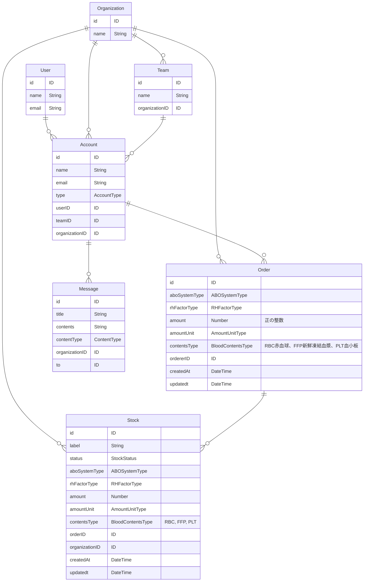

# 基本設計

- 作成者: 横山巧駆 <seekseep@gmail.com>
- 作成日: 2023年8月31日

# ER図

```mermaid
erDiagram

User {
  id ID
  name String
  email String
}

Organization {
  id ID
  name String
}

Account {
  id ID
  name String
  email String
  type AccountType
  userID ID
  teamID ID
  organizationID ID
}

Order {
  id ID
  aboSystemType ABOSystemType
  rhFactorType RHFactorType
  amount Number "正の整数"
  amountUnit AmountUnitType
  contentsType BloodContentsType　"RBC赤血球、FFP新鮮凍結血漿、PLT血小板"
  ordererID ID
  createdAt DateTime
  updatedt DateTime
}

Team {
  id ID
  name String
  organizationID ID
}

Stock {
  id ID
  label String
  status StockStatus
  aboSystemType ABOSystemType
  rhFactorType RHFactorType
  amount Number
  amountUnit AmountUnitType
  contentsType BloodContentsType　"RBC, FFP, PLT"
  orderID ID
  organizationID ID
  createdAt DateTime
  updatedt DateTime
}

Message {
  id ID
  title String
  contents String
  contentType ContentType
  organizationID ID
  to ID
}

User ||--o{ Account: ""
Organization ||--o{ Account: ""
Organization ||--o{ Team: ""
Organization ||--o{ Order: ""
Organization ||--o{ Stock: ""
Team ||--o{ Account: ""
Order ||--o{ Stock: ""
Account ||--o{ Order: ""
Account ||--o{ Message: ""
```
