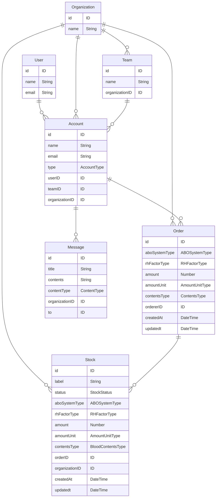

# 基本設計

ノコリの基本設計書

# ER図

```mermaid
erDiagram

User {
  id ID
  name String
  email String
}

Organization {
  id ID
  name String
}

Account {
  id ID
  name String
  email String
  type AccountType
  userID ID
  teamID ID
  organizationID ID
}

Order {
  id ID
  aboSystemType ABOSystemType
  rhFactorType RHFactorType
  amount Number
  amountUnit AmountUnitType
  contentsType ContentsType
  ordererID ID
  createdAt DateTime
  updatedt DateTime
}

Team {
  id ID
  name String
  organizationID ID
}

Stock {
  id ID
  label String
  status StockStatus
  aboSystemType ABOSystemType
  rhFactorType RHFactorType
  amount Number
  amountUnit AmountUnitType
  contentsType BloodContentsType
  orderID ID
  organizationID ID
  createdAt DateTime
  updatedt DateTime
}

Message {
  id ID
  title String
  contents String
  contentType ContentType
  organizationID ID
  to ID
}

User ||--o{ Account: ""
Organization ||--o{ Account: ""
Organization ||--o{ Team: ""
Organization ||--o{ Order: ""
Organization ||--o{ Stock: ""
Team ||--o{ Account: ""
Order ||--o{ Stock: ""
Account ||--o{ Order: ""
Account ||--o{ Message: ""
```

# ER図
