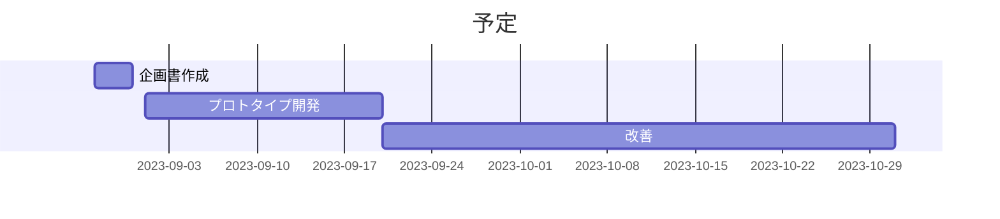

# 企画書

- 作成者: 横山巧駆 <seekseep@gmail.com>
- 作成日: 2023年8月31日

# 現状分析

いくつかの病院では輸血に使う血液の在庫の状況を医師が簡単に確認できない。そのため、有効期限が近い血液を病院内で有効活できていない。

血液は高価なものであり必要以上の購入は病院にとって経済的な問題になっている。

大量の廃棄が起きた場合は再発防止のために始末書の作成や会議が行われるなどして、医師や在庫管理者にあらたな作業を要求することになる。
残業の発生や、病院内での人間関係の悪化にも繋がることも考えられる。

# 概要

病院内の血液の在庫を医師が簡単に確認できるようにし過剰な血液の購入の削減をする。

# 内容

病院内の血液の在庫の管理システムを開発する。

血液の在庫を管理する在庫管理者が在庫状況を管理できるようにし、血液を利用する医師が在庫の状況を確認できるようにする。

血液は血液配給者から受け取ってから有効期限が短く、血液を有効活用するためには在庫状況が即時的に反映される必要がある。
血液の利用申請の業務もシステムに組み込むことでシステムが形骸化することを避ける。

また、医師は他の業務を多く行っているため血液の情報を得るために時間をかけることができない。
血液には複数の属性があるので在庫の検索には素早くできるための工夫が必要である。

さらに、血液の在庫を医師が能動的に調べなくても部署にメールを送るなどして受動的にも在庫状況を知れるようにする。

# 便益

血液の在庫状況を知ることで、病院内での血液の有効活用ができるようになる。
血液が有効活用できるようになると病院は血液の購入量が減るので経費の削減につながる。

さらに、過剰発注への対策の業務が減ることで医師は本来の治療や手術に集中することができる。
医師と在庫管理者との関係の良好化にもつながる。

# 予定

プロトタイプを開発し、知り合いの医師にシステムを触ってもらう。そこで意見をもらいながら改善を重ねる。

2023年9月1日 ~ 2023年10月31日

# 備考

この企画は横山企画が案件獲得のためにシステム開発に関する技術や知識を新たな取引先に示すためのものであり、実際に病院に導入することを前提とはしていない。

実際に病院で輸血の管理に関係する業務を経験した人に意見をもらいながら開発を進める。
