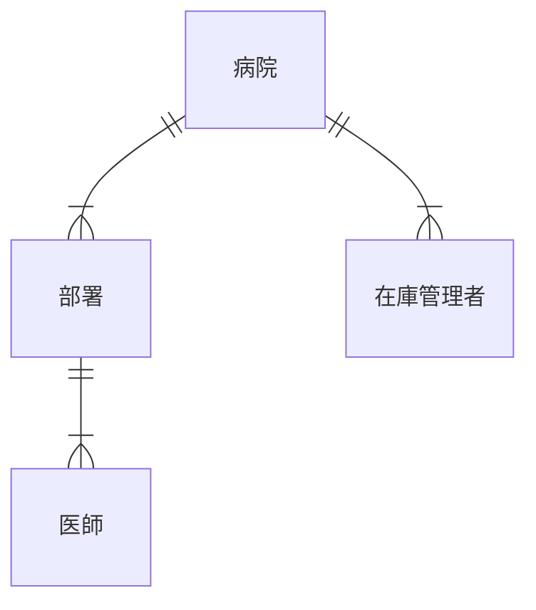
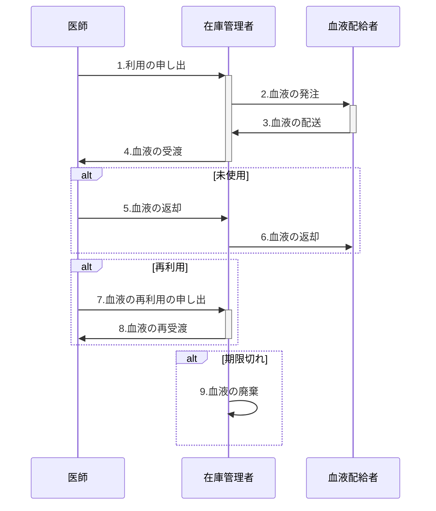
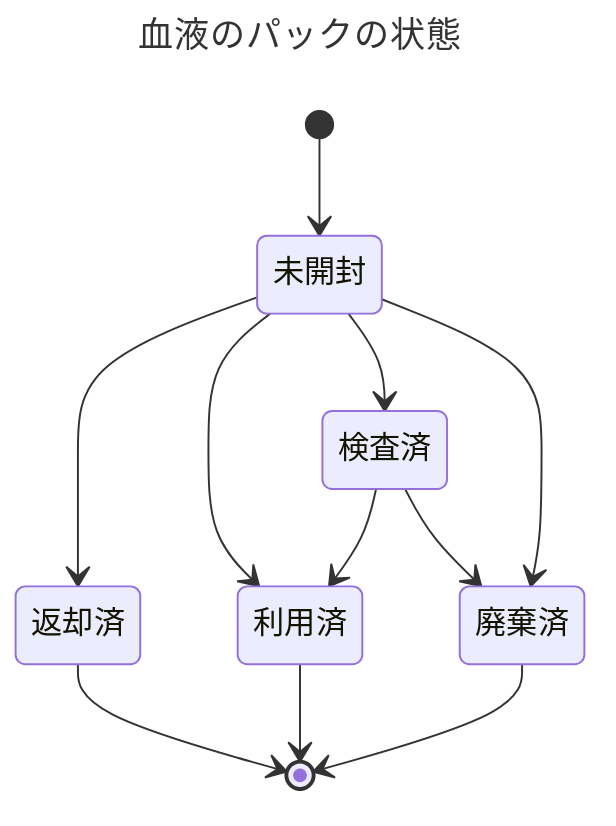

# 業務要件定義書

- 作成者: 横山巧駆 <seekseep@gmail.com>
- 作成日: 2023年8月31日

# 血液配給者

ここでは赤十字社のことを血液配給者とする。在庫管理者は血液配給者に血液を発注することで血液を手に入れる。

# 利害関係者

病院には職員が存在する。病院には内科などの部署が複数存在する。また、病院には職員が複数存在する。
職員には医師と在庫管理者が存在し、医師は１つの部署に所属している。
在庫管理者は血液の在庫の管理を担当し、医師は血液を使って治療を担当する。

# 血液

## 血液の属性

血液には2つの属性を管理対象としている。

|属性|値|
|---|---|
|ABO血液型|A型、B型、O型|
|Rh血液型|陽性、陰性|

## 成分の種類

輸血の種類として3種類ある

|日本語名|英語名|略語|
|---|---|---|
|赤血球|Red Blood Cells|RBC|
|新鮮凍結血漿|Fresh Frozen Plasma|FFP|
|血小板|Platelets|PLT|

# 血液の利用の流れ

1. 医師は在庫管理者に血液の利用を申し出る
2. 在庫管理者は血液配給者に発注する
3. 血液配給者が在庫管理者は発送する
4. 在庫管理者は血液が準備されたら医師に血液を渡す
5. 医師は利用しなかった場合、血液を在庫管理者に返却する
6. 返却可能な場合は血液配給者に血液を返却する
7. 医師はすでにある血液を再利用する場合、申し出る
8. 在庫管理者は医師に血液を渡す
9. 利用されなかった血液を廃棄する

# 血液の発注

## 発注の単位

発注には特別な単位（以下、発注単位）という概念が使われる。発注単位は複数のパックがある。

手術や検査を使う場合はこのパックごとに開封を行う。

## 血液のパックの状態

各血液のパックはいくつかの状態を持つ。未開封のパックのみが返却可能である。

## 成分と発注の単位

成分と発注単位について以下にまとめる

|成分|発注可能単位|単位あたりのパックの数|パックあたりの内容量|
|---|---|---|---|
|赤血球|||
|新鮮凍結血漿|||
|血小板|||

2023年8月31日現在では不明なため調査中
