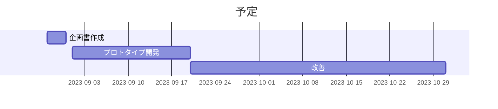

# 企画書

- 作成者: 横山巧駆 <seekseep@gmail.com>
- 作成日: 2023年8月31日

# 現状分析

システム開発では課題管理表の形式を使って課題と作業を管理するプロジェクトがある。

課題管理表は課題と対応内容などを表にまとめて管理する。また、課題管理表はExcelやGoogleスプレッドシートで作成されることが多い。

課題管理表では、プロジェクトを進行していく過程で発見された課題を表に追加していくが課題の形式は自由に記入される。
そのため、課題管理表の形式を軽視するメンバーから「A機能が欲しい」のような課題ではない要望が課題として記入されることがある。
何が課題なのかが明確にされていないため対応がが難しくなる。
このような状態は非課題が管理されていると言える。

また、課題として表現できないものが課題管理表では記録されず忘れられることが多い。そのため言語化されていない課題が取りこぼされやすい。
課題管理表の形式を重視するメンバーはぼんやりとした課題意識を発言することができなかったり、記録されないことがる。
自身の意見がプロジェクトに反映されない経験を重ねるとメンバーのプロジェクトへの参加意識は衰退していく。
このような状態は課題が管理されていないと言える。

ITが社会に普及するに連れて、システム開発が扱う課題は広がっている。
システム開発が扱う課題が特殊になれば、IT以外の領域の専門家とシステム開発者が協力する必要がある。
システム開発に不慣れな専門家が自分の意見が言いづらくなることはプロジェクトに取って悪影響がある。

課題管理表を使ったプロジェクトでは、課題の非管理と非課題の管理が発生しやすい。

# 概要

課題管理表の中で課題と非課題を整理し、管理コストの削減とメンバーの能力の最大化をする。

# 内容

課題管理表を運用するWebアプリケーションを開発する。

課題としては不十分なものを意見とし、アプリケーションで管理する。
新たに作成される課題や、すでに存在する課題に対して意見を関連付けられるようにする。
意見を課題に関連付けられるようにすることで意見を出すことへの動機づけを行う。

また、課題と意見を分けて管理することで課題の一覧の見通しを良くすること目指す。
明確なものだけを課題とすることで作業を行う人の負担を軽減する。

# 便益

各メンバーの意見がでるようにすることでメンバーの専門性を活かせられる様になる。
また、課題が明確になることで作業をするメンバーの負担が軽減され作業の効率が上がる。

意見と課題を明確に分けることで課題の精度が上がりプロジェクトの達成率の向上が期待できる。

# 予定

2023年9月1日 ~ 2023年10月31日

# 備考

意見の管理が課題管理の改善になるという仮説のもとにこの企画がある。

意見の管理によって余計に課題管理が煩雑になる可能性も考えられ、UI設計に依存する部分が大きい。
