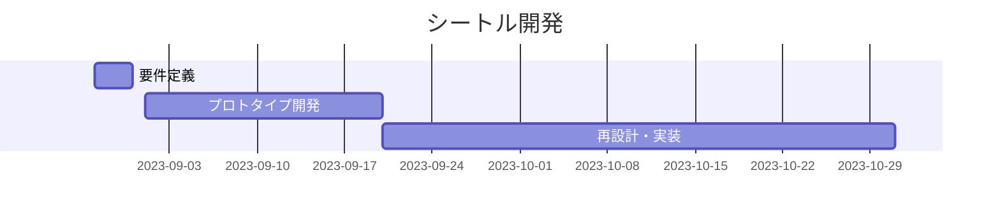

# 企画書

- 作成者: 横山巧駆 <seekseep@gmail.com>
- 作成日: 2023年8月29日

# はじめに

2003年に訪日外国人観光客の増加の目的にビジット・ジャパン・キャンペーンが始まった。2008年には観光庁が発足した。
歴史と文化のある日本では観光事業には十分の潜在能力があり、これから発展させることで日本の経済を支える大きな柱になることが期待されている。

しかし、その反面2025年の壁といわれているように日本ではデジタル化が遅々として進んでいない。
機能としては十分なサービスが山のように存在する市場でも進めることができていない。これはサービスの質だけの問題ではなく社会全体が教育されることを必要としている。

ファミリーレストランを始めとしてテーブルからタブレットを用いて注文することが当たり前になり、子供から大人まで多くの人がそれらに適応できている。その前段階に、iPhoneの普及のような教育段階があったように思われる。

観光事業に向けてデジタル化に向けて、段階的に確実に進められるようなサービスもまた社会に求められている。

# 概要

バスや宿などの予約管理システムを開発する。利用者の知識が不十分な結果導入費用に対して効果が得られない状態ではサービス提供者が十分な対価を得られない。そこで、利用者が段階的に導入できる簡素な予約管理システムを提供することで利用者の教育が進み十分な要望があらわれることを狙っている。その先に様々な価値の提供をもとにサービス提供者の需要が増えるだろうと考えられる。支払い管理などを省き、メールの送信と予約の管理のみが行われるシステムを簡単に使えるようにすることで教育の達成を狙う。

# 目的

## 課題

多機能で効果な予約管理システムが多く存在しているために費用対効果の観点から導入しても赤字になると考えている企業が多く存在すると考えられる。
しかし、サービス提供者は競合他社と差別化を図るために機能追加に躍起になり投資を回収するために利用料金をあげようとしている。

## 解決策

学習コストが少なく業務に導入できるサービスを作成し利用者を教育することで高機能への需要を生み出し、業務の電子化を加速する。

## 成果物

予約管理のWebアプリケーション。名前はシートル(Seatl)。

### 前提

|用語|説明|
|---|---|
|旅行者|旅行をする人、このサービスで予約を取り旅行時に利用する|
|事業|旅行に関する事業、観光バスや宿|
|事業者|旅行に関する事業を経営する人、バスや宿の経営者|
|予約|事業を利用するための予約|
|申込|予約に対する申し込み、事業者が承諾すると予約になる|
|席|席は一人が予約できる単位、２人予約する場合は２席必要と考える|
|箱|席をまとめる単位|
|予定|席が使える予定、事業の休日等を登録する|

### 内容

基本的な利用の流れとしては以下の通り

1. 事業者は席と箱と予定を設定する
2. 旅行者は席を予約するために申し込みをする
3. 申し込みが行われると事業者にメールが届く
4. 事業者はメールの内容を確認して申し込みを承諾し予約を作成する
5. 予約が作成されると旅行者にメールが届く

料金の受け取りはこのシステムでは管理対象としない

# 開発

## メンバー

横山が設計と開発を行う

## 期間

2023年9月1日 ~ 2023年10月31日

# リスク

## 作業時間の確保の不確実さ

横山自身が、他の案件と並行してこのプロジェクトを実施するため作業時間が確保できず完成できない場合がある。
このリスクに対しては現状解決策がない。不確実なままプロジェクトをすすめることを受け入れる。
