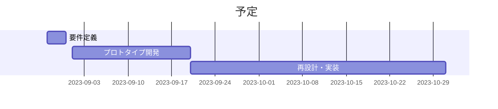

# 企画書

- 作成者: 横山巧駆 <seekseep@gmail.com>
- 作成日: 2023年8月31日

# 現状分析

業務にシステムを取り入れる、いわゆるデジタル化が進まない組織にはデジタル化による便益が想像できないことが大きな要因の一つになっている。
それに反して、業務のデジタル化を進めたいシステム開発者、またはサービス提供者は開発にかかった費用を回収するために利用料を高価に設定しようとする。

便益が想像できない組織は、高機能で高価なシステムは導入したいとは思えないため導入を見送ることが多い。
その背景にはシステムを有効活用した経験の無さと、高機能への需要の無さがある。

デジタル化に求められるのは業務の改善だけではなく、デジタル化への需要である。

2003年に日本政府が始めたビジット・ジャパン・キャンペーンの影響もあり訪日外国人観光客は増えていた。コロナ禍で一時激減した観光客も2023年8月現在回復の傾向を見せている。

日本は歴史が長いため、多くの地方が観光地としての可能性を持っている。その反面、地方では高齢化が進み人材不足に悩まされている。
デジタル化は業務の自動化を行うことができ、人材不足の解決に大きく貢献できるが上記のような理由で進んでいないと考えられる。

ホテルやバスなどの予約は現在でも電話やFAXを使っている業者も多い。予約状況の確認や予約の管理は電話の窓口を通さなくても行える業務である。

# 概要

導入コストが引くい予約管理システムを開発することで地方の業者へのデジタル化に対する需要を促進する

# 内容

予約に関する機能だけに絞った予約管理システムを作る。

業者は予約できる席や部屋と営業時間など最低限の情報を入力することで予約の受付を開始できるようにする。
また、顧客はWebのフォームから予約を行い発行された予約番号またはURLから予約の状況を確認できるようにする。

決済や関連企業の検索のような過剰な機能を実装しないことで利用者の学習コストと利用費を抑えることを目指す。

# 便益

業者の規模が小さい間は少機能の当アプリケーションで業務のデジタル化が進み経費が削減される。

業者の組織がデジタル化された業務に慣れると大手が開発している高価で高機能なシステムの導入でも費用対効果が期待できるようになる。
さらなる組織の拡大と業務の改善が進みやすくなる。

# 予定

2023年9月1日 ~ 2023年10月31日

# 備考

業界全体のデジタル化への需要の促進を目的としているため、このアプリケーションは長期的に維持することを目的としていない。

システム開発者として高価なサービスの開発に必要な前段階として考えている。
